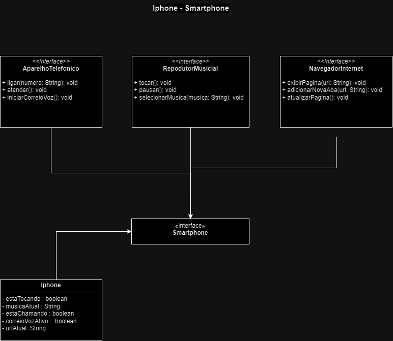

# POO e UML: Diagramação de Classes

Trabalhando como modelagem e diagramação da representação em UML, que represente as classes e 
interfaces necessárias para implementar as funcionalidades de um Smartphone Iphone com seguintes finalidades:

- Repodutor Musicial: 
  - tocar
  - pausar
  - selecionarMusica
- Aparelho Telefônico: 
  - ligar
  - atender
  - iniciarCorrerioVoz
- Navegador na Internet: 
  - exibirPagina
  - adicionarNovaAba
  - atualizarPagina

